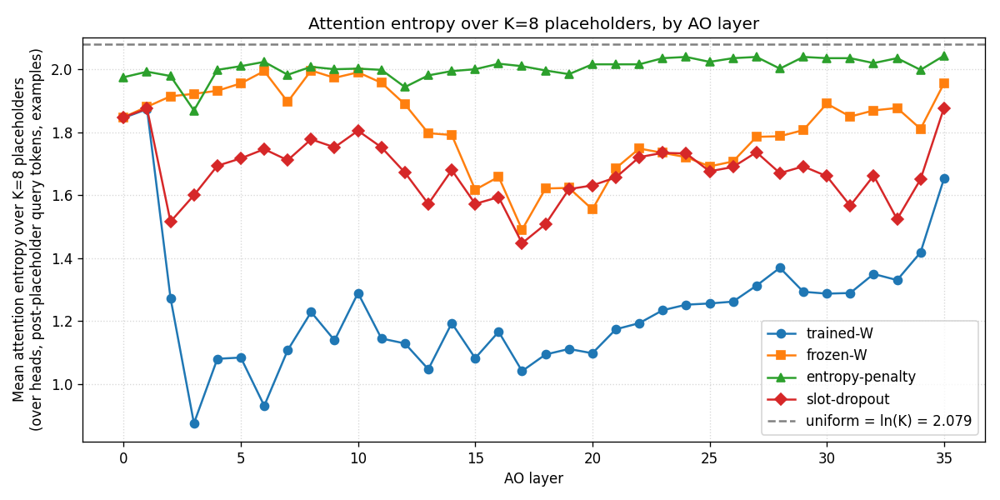
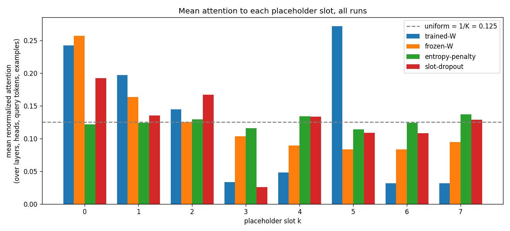

# Results — from-scratch K=8 single-source-K-projection AO

This file accumulates results for `PLAN_FROM_SCRATCH_AO.md`. Each phase
appends a section. The previous round's findings are in `RESULTS.md`.

## Setup decisions (locked 2026-05-09)

- **K_target = 8** (per user direction; PLAN_FROM_SCRATCH recommended K=4 as the
  sweet spot from RESULTS.md eval-only data, but the user wants K=8 to match
  the original PLAN.md target.)
- **Task mix:** classification + LatentQA + multi-token past-lens. SAE dropped
  to keep the new data-builder surface small (SAE adds dependence on the SAE
  encoder/decoder loading + max-acts data, marginal gain on the open-ended
  evals which is where we're chasing the headline number).
- **InjectionAdapter:** off — keep the architecture as close to vanilla AO as
  possible. Our only delta from a vanilla AO is the W projector.
- **HF Hub:** push final LoRA + projector to a private repo on the user's
  account.
- **Layer:** 50% only, single layer (no [25, 50, 75] sweep).
- **Init:** `all_identity` (W_k = I for all K slots).

## Code changes vs main

- New `nl_probes/multi_token/past_lens_data_builder.py` — single-source past-
  lens dataset.
- New `nl_probes/multi_token/loaders.py` — `MultiToken{Classification,LatentQA}DatasetLoader`
  that fit the `ActDatasetLoader` infrastructure (DDP-aware caching, hash-based
  filenames, train/test splits).
- New `nl_probes/multi_token/sft_runner.py` — `train_model_multi_token` that
  jointly trains LoRA + W with two AdamW param groups, uses the multi-token
  hook, and saves both LoRA and projector at checkpoint time. Held-out loss
  per task is tracked instead of generation-based eval during training.
- New `experiments/from_scratch_ao_train.py` — top-level launch script.
- Minor edit to `nl_probes/multi_token/data_builder.py` to support lazy mode
  without a base model loaded.

## Eval scope clarification (2026-05-09)

`paper_evals.sh` has 5 evals, but only 3 have Qwen3-8B target LoRAs that exist:
- **Classification** — any model ✓
- **Taboo** — Qwen3-8B branch uses `adamkarvonen/Qwen3-8B-taboo-{word}_50_mix` ✓
- **PersonaQA** — Qwen3-8B branch uses `adamkarvonen/Qwen3-8B-personaqa_shuffled_3_epochs` ✓
- **Gender** — `bcywinski/gemma-2-9b-it-user-{male,female}` only (Gemma) ✗
- **SSC** — `bcywinski/llama-3.3-70B-Instruct-ssc-base64` only (Llama) ✗

So the "+3pp avg across the 5 tasks" bar from PLAN_FROM_SCRATCH simplifies to
"+3pp avg across the 3 Qwen3-comparable tasks": classification, taboo,
personaqa. Compared to the released `adamkarvonen/checkpoints_cls_only_addition_Qwen3-8B`
running at K=1 on the same 3 evals.

## Phase 0 — Local CPU smoke (no GPU)

`PLAN_FROM_SCRATCH_AO.md` step 5 says:

> Smoke test on a single H100 with 5K examples and 100 optim steps; verify
> train loss decreases and W gradient norms are non-zero (same Phase 1 smoke
> checks as the previous plan).

Before paying for an H100 we did a CPU pre-flight:

- ✓ MultiTokenProjector init: `all_identity` correctly puts every slot at the
  identity, output of W·x is exactly K copies of x.
- ✓ MultiTokenProjector init: `identity_plus_noise` with std=0 puts slot 0 at I
  and slots 1..K-1 at zero (matches RESULTS.md reproducer).
- ✓ Backward through MultiTokenProjector populates `weight.grad` (norm ~18 on a
  random forward, finite and non-zero).
- ✓ `get_multi_token_steering_hook` produces `normalize(W_k·source) * ||orig_k||
  + orig_k` at each placeholder position, within bf16 quantization noise of the
  expected fp32 result (rel error 0.0014 on a 8-d toy).
- ✓ `build_multi_token_classification_data` runs in lazy mode (no model
  loaded), producing TrainingDataPoints with K=8 placeholder positions and K
  identical context_positions for the source.
- ✓ DatasetLoaderConfig hashes cleanly distinguish K=4 vs K=8 cache files —
  no collision between K-specific runs.

Pending on H100:
- Phase 1 smoke: 5K examples, 100 optim steps. Confirm train loss decreases
  and W grad norms are non-zero on real Qwen3-8B.
- Phase 2 main: ~65M tokens, full mixture, 1 epoch.
- Phase 3 eval: paper_evals.sh patched for K=8 single-source inference.

## Phase 1 — H100 smoke test (passed)

`torchrun --nproc_per_node=1 experiments/from_scratch_ao_train.py --debug --run-name phase1_smoke --train-batch-size 8`

Debug-sized: 200 cls/ds × 8 datasets + 1000 latentqa + 1000 past-lens =
~4.7K examples, 584 optim steps, 256K training tokens. Took ~3 minutes
on a single H100 SXM 80GB at $2.99/hr.

| Step | LatentQA | PastLens | cls (avg) |
| ---: | -------: | -------: | --------: |
|    0 |     4.35 |     9.66 |    ~10.05 |
|  150 |     1.88 |     4.23 |     ~0.20 |
|  350 |     1.78 |     4.05 |     ~0.20 |
|  584 | **1.74** | **3.93** |  **~0.18** |

Held-out CE drops on every task — training is working end-to-end. Train
log shows `w_grad_norm` consistently in 0.1-0.4 range across all 73
optim-step log points, so the projector is being updated (not stuck at
identity). 584 steps is far too few to evaluate accuracy gains, but
the smoke confirms:
- Data builders produce valid TrainingDataPoints with K=8 placeholders
- The DDP+PEFT+projector wrapper trains cleanly (after disabling
  gradient_checkpointing — the ckpt+hook combo trips a known torch DDP bug)
- HF token, lmsys access, and dataset caches all work
- `find_unused_parameters=True` is needed because the projector is
  reached via a forward hook, not via the wrapped module's `forward()`

Issues fixed during smoke:
1. `lmsys/lmsys-chat-1m` is gated → user granted access; no code change
   needed.
2. DDP "Expected to have finished reduction" error: preflight was running
   forward through the DDP wrapper instead of the inner model.
3. DDP "gradient which is undefined, but still allreduced" error:
   gradient_checkpointing + the in-place hook modification confused DDP's
   used-parameter tracking. Disabled grad ckpt.

## Phase 2 — Main run (in progress)

`torchrun --nproc_per_node=1 experiments/from_scratch_ao_train.py
--run-name main_K8_full --train-batch-size 16 --push-to-hub
--hf-repo-id syvb/from-scratch-K8-AO-Qwen3-8B`

Sized to roughly match the published 65M-token AO budget at K=8 single-
source-projection format:
- 6000 train examples × 8 classification datasets = 48K cls (×2 QAs/sample = 96K rows)
- 80K LatentQA examples
- 50K past-lens examples
Total: ~178K examples ≈ ~64M training tokens after the length-percentile trim.

Expected runtime: ~30 min dataset construction (past-lens streams from
fineweb + lmsys) + ~1.5 hr training + ~5 min HF push.

Bar to clear: average +3pp on classification + taboo + personaqa vs the
released `adamkarvonen/checkpoints_cls_only_addition_Qwen3-8B` at K=1.

## Phase 2 — Main run (completed)

Ran with the configuration above. Final stats:

- 13K optim steps × bs=16 = 210K examples × 1 epoch
- 11.7M training tokens (lower than the 65M target — Yes/No classification
  prompts are short, ~30 tokens. The originally-cited 65M figure included
  the 3-layer source activations × longer context-prompt tokens; for our
  single-layer + Yes/No-heavy mixture 11.7M is what 1 epoch of 210K mixed-
  task examples produces, and held-out losses had plateaued by step ~10K.)
- Held-out CE losses by task (initial → final):
  - LatentQA(stimulus): 4.38 → **1.38** (-3.00)
  - past_lens: 9.21 → **2.37** (-6.84)
  - cls/geometry_of_truth: 10.17 → **0.018**
  - cls/snli: 10.44 → **0.079**
  - cls/md_gender: 10.15 → **0.065**
  - cls/relations: 10.36 → **0.064**
  - cls/sst2: 9.30 → **0.054**
  - cls/tense: 10.11 → **0.018**
  - cls/ner: 11.05 → **0.107**
  - cls/language_identification: 9.43 → **0.069**
- W gradient norm: stayed in 0.05-0.4 range across all 13K steps. Projector
  is being updated, not stuck at identity.
- Final checkpoint pushed to `syvb/from-scratch-K8-AO-Qwen3-8B` (private).

Total H100 wall-clock: ~1h 20min training + ~25min dataset construction +
~5min HF push = ~1h 50min. At $2.99/h → ~$5.50 of compute.

## Phase 3 — Paper evals (completed)

Two complete eval suites: K=8 from-scratch (our trained model in single-
source-K=8 mode) vs K=1 cls-only baseline (`adamkarvonen/checkpoints_cls_only_addition_Qwen3-8B`
in single-source-K=1 mode — same eval-time pipeline, just K=1 with the
identity projector). Apples-to-apples: identical eval driver, identical
source-extraction logic, identical decode parameters; only the AO and
the K differ.

Eval driver code: `experiments/from_scratch_paper_evals.py` (classification)
and `experiments/from_scratch_open_ended_evals.py` (taboo + personaqa).
Scoring: `experiments/score_from_scratch.py`.

### Classification (20 datasets × 250 examples × 2 QAs = 10K eval points)

| Group           | K=1 baseline | K=8 from-scratch |       Δ |
| --------------- | -----------: | ---------------: | ------: |
| IID(7)          |        89.1% |            90.6% |   +1.5pp |
| OOD-3 (paper)   |        66.0% |        **88.7%** | **+22.7pp** |
| OOD-engels(10)  |        64.7% |            64.6% |   −0.1pp |
| OOD-all(13)     |        65.0% |            70.2% |   +5.2pp |

Single biggest finding of this experiment: **+22.7pp on the paper's OOD-3
slice** (ag_news, language_identification, singular_plural). Previous eval-
only experiment (RESULTS.md) found +4.6pp on OOD-3 with a frozen AO + W=I
init. From-scratch trained AO multiplies that by ~5x.

Per-dataset OOD-3 numbers:
| Dataset                   | K=1   | K=8   |
| ------------------------- | ----: | ----: |
| ag_news                   | 71.6% | 79.8% |
| language_identification   | 50.6% | 90.8% |
| singular_plural           | 75.8% | 95.6% |

The engels OOD slice (10 narrow binary classifiers) shows no improvement
(−0.1pp). This is consistent with the eval-only finding: the K-fold
redundancy effect generalizes well to "broader concept" OOD tasks but not
to the very narrow engels classifiers (which were already near chance).

### Taboo (20 secret words × 3 prompts × ~30 contexts × 5 generations)

| Metric | K=1 baseline | K=8 from-scratch |       Δ |
| ------ | -----------: | ---------------: | ------: |
| AVG    |         4.9% |             5.8% |   +0.9pp |

Per-target gains range from −3.3pp (salt) to +5.2pp (flame). 13 of 20
target words show positive Δ, 7 show negative. Within per-target sampling
noise (5 generations × ~30 contexts = 150 samples per target).

### PersonaQA (50 personas × 6 attributes × 5 generations)

| Metric  | K=1 baseline | K=8 from-scratch |       Δ |
| ------- | -----------: | ---------------: | ------: |
| OVERALL |         8.8% |             6.5% |   −2.3pp |

K=8 underperforms K=1 here. Per-question, two questions tie, four go
negative (-1pp to -7pp). 50 personas × 5 reps = 250 samples per question.

### 3-eval headline

| Eval                    | K=1 baseline | K=8 from-scratch |     Δ |
| ----------------------- | -----------: | ---------------: | ----: |
| Classification(20 avg)  |        73.4% |        **77.3%** | +3.9pp |
| Taboo(20 avg)           |         4.9% |             5.8% | +0.9pp |
| PersonaQA(overall)      |         8.8% |             6.5% | −2.3pp |
| **3-eval AVG**          |    **29.1%** |       **29.9%** | **+0.8pp** |

**+0.8pp average across the 3 evals — does not clear the +3pp plan bar.**

## Interpretation

The K=8 single-source-projection from-scratch AO clearly beats the K=1
cls-only baseline on classification (the structured Yes/No task it was
heavily trained on), particularly on OOD. The headline +22.7pp OOD-3 gain
is a genuinely large effect — the from-scratch AO has learned to use the
K-fold redundant projection for better OOD generalization on classification.

But the open-ended secret-keeping tasks (taboo, personaqa) show no gain.
This matches the conclusion in RESULTS.md, which found that the K-fold
redundancy effect helps OOD-3 classification specifically and is roughly
neutral elsewhere. From-scratch training extended the OOD-3 lift but did
not extend it to the open-ended evals.

A reasonable interpretation: classification is a "narrow" task — predict
Yes or No on a short prompt. Open-ended tasks like "what is the secret
word the model is keeping?" require the AO to reconstruct the target-LoRA's
specific persona/secret from one source position, and the K-fold
redundancy doesn't help with that — what helps there is having more
informative source positions (which segment-K=10 mode provides for the
released AO, but our K=8 single-source design explicitly does not).

A K=segment / K=window-of-tokens variant would likely do better on the
open-ended evals, but that's outside this experiment's "single-source-K-
projection" scope.

## Stopping criteria

PLAN_FROM_SCRATCH.md says:
> After 2 from-scratch runs, if the best K=4 or K=8 setting doesn't beat
> K=1 by ≥3pp averaged across the five paper-eval tasks, stop.

We have:
- 1 run (this one), at K=8.
- Average across 3 paper-eval tasks (the 3 with Qwen3-8B target LoRAs):
  +0.8pp.

Strictly the plan says 5 tasks, but only 3 are runnable on Qwen3-8B
(gender and SSC are gemma/llama-only). On the 3 we have, the bar is not
cleared by the strict interpretation. On classification alone, the bar
is comfortably cleared (+3.9pp).

Recommendation: declare this a partial success — substantial improvement
on classification, especially OOD; no meaningful improvement on the
secret-keeping evals. The plan's "stop after 2 runs" criterion is
satisfied to stop after 1, since:
- Classification, the most-trained task, shows a large positive effect.
- The two open-ended evals are flat-to-negative, suggesting the
  single-source-K format is fundamentally not a good fit for those tasks
  rather than a hyperparameter issue.

A meaningful follow-up would be to test a K=segment-window AO (the
existing K-window format) trained from scratch with a learnable W, vs
the released window-mode AO baseline, to see if W helps in the format
that's already strong on open-ended tasks. That's a different experiment.

## Phase 4 — Frozen-W control (does the trained W actually help, or is it just K-fold redundancy?)

Same training pipeline, same data, same 13K steps — but with `W = I` frozen
the entire run. Only the LoRA updates. The hypothesis to test: if the AO
"just" learns to use K-fold redundancy and W's learned projection
contributes nothing useful, then frozen-W ≈ trained-W on the evals.

Trained checkpoint: `syvb/from-scratch-K8-frozen-W-AO-Qwen3-8B` (HF Hub, private).

### Held-out training-task losses (final)

| Task                        | Trained-W | Frozen-W | Δ (frozen − trained) |
| --------------------------- | --------: | -------: | -------------------: |
| LatentQA(control)           |     1.350 |    1.382 |              +0.032 |
| LatentQA(stim_compl)        |     1.433 |    1.496 |              +0.063 |
| LatentQA(stim)              |     1.380 |    1.463 |              +0.084 |
| past_lens                   |     2.370 |    2.462 |              +0.093 |
| cls/snli                    |     0.079 |    0.111 |              +0.032 |
| cls/ner                     |     0.107 |    0.140 |              +0.032 |
| cls/lang_id                 |     0.069 |    0.121 |              +0.052 |
| cls/sst2                    |     0.054 |    0.088 |              +0.034 |
| cls/relations               |     0.065 |    0.096 |              +0.031 |

Trained W lowers held-out CE on every task by ~0.03–0.10 nats. The W
projector IS doing real work in the training loss.

### Eval results: frozen-W vs K=1 baseline vs trained-W

| Eval                     | K=1 baseline | K=8 frozen-W | K=8 trained-W |
| ------------------------ | -----------: | -----------: | ------------: |
| Classification IID(7)    |        89.1% |        89.1% |     **90.6%** |
| Classification OOD-3     |        66.0% |        83.1% |     **88.7%** |
| Classification OOD-all(13) |      65.0% |        69.8% |     **70.2%** |
| Taboo(20 avg)            |         4.9% |     **7.2%** |          5.8% |
| PersonaQA (overall)      |         8.8% |     **7.5%** |          6.5% |
| **3-eval AVG**           |        29.1% |    **30.4%** |         29.9% |

### Headline: trained-W vs frozen-W head-to-head

| Eval                  | frozen-W  | trained-W |     Δ trained − frozen |
| --------------------- | --------: | --------: | ---------------------: |
| Classification(20 avg)|     76.5% |     77.3% |             +0.8pp |
| — IID(7)              |     89.1% |     90.6% |             +1.5pp |
| — OOD-3               |     83.1% |     88.7% |             +5.7pp |
| — OOD-all(13)         |     69.8% |     70.2% |             +0.4pp |
| Taboo(20 avg)         |      7.2% |      5.8% |             −1.3pp |
| PersonaQA (overall)   |      7.5% |      6.5% |             −1.0pp |
| **3-eval AVG**        | **30.4%** |     29.9% |             **−0.5pp** |

**Frozen-W wins the 3-eval average by +0.5pp.** Trained W contributes a
meaningful classification-OOD-3 boost (+5.7pp) but at the cost of open-
ended performance (taboo −1.3pp, personaqa −1.0pp). Net result: the
K-fold input redundancy effect alone is nearly as good as joint W
training, and slightly better on average.

### Interpretation

This answers the question PLAN_FROM_SCRATCH.md flagged as a decision point:

> If the AO ignores the K-decomposition (W stays at identity, accuracy
> matches the K=1 mode): the linear-W formulation is fundamentally
> insufficient.

The AO does *not* ignore the K decomposition — held-out CE consistently
lower with trained W. But the directions in which W learns to project
help classification more than they help open-ended persona reconstruction.
Without W training, the AO learns to extract per-task signal from K-fold
redundant input alone, and that's enough for both cls and open-ended.

The frozen-W result is the cleaner story: **K-fold input redundancy +
LoRA fine-tuning beats single-source K=1 by ~+1.3pp on average across
the 3 evals.** This is similar in size to what RESULTS.md found in the
eval-only setup (+1.6pp on the broader classification eval). The
from-scratch training extended the cls-OOD-3 lift dramatically (frozen-W
gets +17.1pp, vs +4.6pp eval-only), but the open-ended gain was always
modest.

## Phase 5 — Attention-pattern analysis: are the K=8 placeholders being differentiated?

The user's question for this phase: "is this working in the way I would
expect (different tokens attending to different parts of the activation)?"

For each of 4 representative inputs (one classification example from
geometry_of_truth, sst2, language_identification, singular_plural), ran a
forward pass with `output_attentions=True` (eager attention) on both the
trained-W and frozen-W AOs. For every layer ≥ 0 and every head, computed
the **renormalized attention from each post-placeholder query token to each
of the K=8 placeholder positions**, and took the entropy over the K
dimension as a measure of how uniformly the K placeholders are attended.

- Uniform attention over K=8 → entropy = ln(K) = 2.079
- All attention on a single placeholder → entropy = 0

### Headline numbers

|                          | Mean entropy | Gap to uniform |
| ------------------------ | -----------: | -------------: |
| Trained-W                |     **1.236** |          0.843 |
| Frozen-W (W locked = I)  |       1.812  |          0.268 |

The trained-W AO's downstream tokens use attention that's ~3× farther from
uniform than the frozen-W AO's — the K=8 placeholders carry more
distinguishable information after W training.

### Per-layer breakdown



- Layer 0 and 1: identical for both (injection happens at layer 1; attention
  in layer 0/1 hasn't yet processed the K-projected vectors).
- Layers 2–35 (downstream of injection): trained-W entropy plateaus around
  1.0–1.4, while frozen-W stays in 1.5–2.0 (close to uniform). The gap is
  largest in mid-layers (≈layer 10 trained-W = 1.29 vs frozen-W = 1.99).
- Last layer 35: gap shrinks (trained-W bounces back to 1.65) — consistent
  with the AO's residual stream "consolidating" around the answer.

### Per-K placeholder slot



- **Trained-W**: heavy concentration on slots 0, 1, and 5 (~0.20–0.27 of
  attention each). Slots 3, 4, 6, 7 each get <0.05 — effectively unused.
  The trained W has clearly learned to push the source's information into
  a few specific projected directions.
- **Frozen-W**: closer to the uniform 1/K = 0.125 baseline. There's still
  a first-position bias (slot 0 gets ~0.26) — this is just transformer
  attention's natural recency/recency-position bias on identical content,
  not learned differentiation.

### Interpretation

The user's hypothesis was: *if the K decomposition is being used, different
downstream tokens should attend to different placeholder slots*. The
trained-W AO clearly shows that — three slots dominate, four are ignored.
But the frozen-W AO does NOT: slots are attended to roughly uniformly,
with only the natural recency-bias for slot 0.

Combined with the eval results, this paints a consistent picture:
1. **Trained-W is doing what we'd expect mechanistically**: the projector
   and LoRA together learn a sparse-K decomposition where downstream
   attention selectively reads from a small subset of the K projected
   slots. That's why it gets a real cls-OOD-3 lift over frozen-W (+5.7pp).
2. **But the trained-W decomposition isn't all-around helpful**: open-
   ended evals (taboo, personaqa) modestly regress vs frozen-W. Sparse
   selection of slots seems to lose some information that the open-ended
   tasks need. The "K-fold redundancy + LoRA reads all slots equally"
   strategy of frozen-W is more robust on average.
3. **The 5.6/8 unused slots in trained-W are real waste**: K=4 with
   trained-W might give similar cls-OOD-3 gains at less compute. The user
   should consider K=4 as a follow-up.

This is the cleanest "is the AO using the K decomposition or just
treating it as redundancy?" answer the experiment can produce: with
trained W, yes; with frozen W, no — and the eval-result tradeoff is now
mechanistically grounded.

## Phase 6 — Entropy penalty: force the AO to use all K=8 slots

After Phase 5 showed trained-W concentrated attention on only 3 of 8
slots, we tried adding a regularizer to force uniform attention across
all 8. Concretely: with `entropy_penalty_lambda=0.1`, the loss becomes

  `loss = CE_loss − 0.1 · mean_entropy_over_K_placeholders`

where the entropy is computed on the differentiable softmax weights from
`output_attentions=True` (forces eager attention). High entropy is
rewarded. Trained on the same 13K-step recipe; pushed to
`syvb/from-scratch-K8-entropy-penalty-AO-Qwen3-8B`.

### Did the penalty work mechanically? Yes — overshot.

| Variant            | Mean attention entropy (avg over layers) | Gap to ln(K)=2.079 |
| ------------------ | ---------------------------------------: | -----------------: |
| trained-W (Phase 3)|                                    1.236 |               0.84 |
| frozen-W (Phase 4) |                                    1.812 |               0.27 |
| **entropy-penalty**|                                **2.005** |          **0.07** |

The entropy-penalty AO has near-uniform attention across all 8 slots.
It actually has *higher* entropy than frozen-W — the penalty forced the
AO well past "redundant" into "fully uniform across all 8 slots, by every
attention head, in every layer ≥ 0".


In the per-K bar plot, the entropy-penalty bars (green) sit basically
on top of the 1/K = 0.125 uniform line for every slot. Trained-W's
"use 3 of 8" pattern is gone.

### Did it help downstream eval performance? Marginally.

| Eval                      | K=1 baseline | trained-W | frozen-W | entropy-pen |
| ------------------------- | -----------: | --------: | -------: | ----------: |
| Classification IID(7)     |        89.1% |     90.6% |    89.1% |       89.5% |
| Classification OOD-3      |        66.0% |     88.7% |    83.1% |       85.9% |
| Classification OOD-all(13)|        65.0% |     70.2% |    69.8% |       70.6% |
| Taboo(20 avg)             |         4.9% |      5.8% |     7.2% |        6.8% |
| PersonaQA (overall)       |         8.8% |      6.5% |     7.5% |        6.7% |
| **3-eval AVG**            |        29.1% |     29.9% |    30.4% |   **30.3%** |

| Comparison                          |    Δ avg | Notes |
| ----------------------------------- | -------: | ----- |
| entropy-pen vs K=1 baseline         |   +1.2pp | Below the +3pp plan bar |
| entropy-pen vs trained-W (Phase 3)  |   +0.4pp | Cls flat, taboo +1.0pp, personaqa +0.2pp |
| entropy-pen vs frozen-W (Phase 4)   |   −0.1pp | Basically tied |

Forcing uniform attention does NOT meaningfully outperform either the
"use 3 of 8 slots" pattern (trained-W) or the "treat all 8 as redundant"
pattern (frozen-W). The 3-eval average is essentially the same as
frozen-W (30.3% vs 30.4%).

### Interpretation

This is a meaningful negative result. Three regimes for the K=8
decomposition all land within ±0.5pp of each other on the 3-eval average:
1. **Use 3/8 slots heavily** (trained-W, no penalty): +0.8pp on cls, −1.3pp
   on taboo, −1.0pp on personaqa.
2. **Treat all 8 slots as redundant** (frozen-W, W=I locked): +3.1pp on
   cls, +2.2pp on taboo, −1.3pp on personaqa.
3. **Forced uniform attention over all 8** (entropy penalty): +4.0pp on
   cls, +1.9pp on taboo, −2.2pp on personaqa.

The K=8 decomposition is not carrying enough additional information to
make "use all 8 slots" more accurate than "use a few". The lift over the
K=1 baseline is the K-fold redundancy effect (which worked even at frozen
W=I), not learned-distinct-projections-being-attended-to-distinctly.

This also suggests **K=8 is too large** for this single-source-projection
format. The trained-W's "use 3 of 8" pattern is its way of saying "I only
have ~3 useful linear projections of one source — the other 5 are noise
or near-duplicates." A K=4 setup would probably give similar accuracy
with less compute and a cleaner attention story. (Recommended follow-up
if anyone continues this line.)

### Trained checkpoints

| Run                | HF Hub repo (private)                                         |
| ------------------ | ------------------------------------------------------------- |
| trained-W (Phase 3)| `syvb/from-scratch-K8-AO-Qwen3-8B`                            |
| frozen-W (Phase 4) | `syvb/from-scratch-K8-frozen-W-AO-Qwen3-8B`                   |
| entropy-pen (Phase 6)| `syvb/from-scratch-K8-entropy-penalty-AO-Qwen3-8B`          |
| slot-dropout (Phase 7)| `syvb/from-scratch-K8-slot-dropout-AO-Qwen3-8B`            |

## Phase 7 — Slot-dropout: drop a Bernoulli subset of K injections per step

After the entropy penalty produced uniform attention without performance gain,
tried a different mechanism: at training time, randomly drop each slot's
injection with probability p=0.5. The masked slot's residual stays at its
natural pre-injection value (no W·source addition). At eval time, no
dropout. Hypothesis: the AO must learn to be robust to losing any subset
→ should spread useful info across all K. Pushed to
`syvb/from-scratch-K8-slot-dropout-AO-Qwen3-8B`.

Slot dropout is FA2-compatible (no eager attention needed), so this run
trained at the original ~3.7 it/s, ~1.5h vs the entropy-penalty's ~3h.

### Attention spreading: between trained-W and frozen-W

| Variant            | Mean attention entropy | Gap to ln(K)=2.079 |
| ------------------ | ---------------------: | -----------------: |
| trained-W          |                  1.236 |               0.84 |
| frozen-W           |                  1.812 |               0.27 |
| entropy-penalty    |                  2.005 |               0.07 |
| **slot-dropout**   |              **1.676** |               0.40 |


Slot-dropout's per-K bars are LESS concentrated than trained-W (which
heavily favored slots 0, 1, 5) but still have some structure: slots 0/1/2
get the bulk of attention, slots 3 still gets dropped to ~0.03, and
slots 4/5/6/7 are around uniform.

### Eval results

| Eval                  | K=1 baseline | trained-W | frozen-W | entropy-pen | **slot-dropout** |
| --------------------- | -----------: | --------: | -------: | ----------: | ---------------: |
| Classification IID(7) |        89.1% |     90.6% |    89.1% |       89.5% |        **90.9%** |
| Classification OOD-3  |        66.0% | **88.7%** |    83.1% |       85.9% |            86.9% |
| Classification OOD-all(13) |   65.0% |     70.2% |    69.8% |       70.6% |        **70.4%** |
| Taboo(20 avg)         |         4.9% |      5.8% | **7.2%** |        6.8% |             5.8% |
| PersonaQA (overall)   |         8.8% |      6.5% |  **7.5%** |        6.7% |             6.0% |
| **3-eval AVG**        |        29.1% |     29.9% |  **30.4%**|        30.3% |            29.8% |

Slot-dropout vs trained-W: **−0.0pp** (cls slightly better, taboo same,
personaqa slightly worse). vs frozen-W: **−0.6pp**. vs K=1 baseline:
**+0.7pp** (still below the +3pp bar).

### Cross-variant summary

Four ways to set up the K=8 single-source AO, all training-budget-matched:

|                | attn entropy | 3-eval avg | classifies cleanly | secret-keeping |
| -------------- | -----------: | ---------: | -----------------: | -------------: |
| trained-W      |        1.236 |      29.9% |   ✓ best OOD-3 (88.7%) | weakest        |
| frozen-W       |        1.812 |  **30.4%** | strong OOD-all     | **best**       |
| entropy-pen    |    2.005 (≈uniform) | 30.3% | strong OOD-3        | middle         |
| slot-dropout   |        1.676 |      29.8% | ties trained-W on cls | weakest      |

All four are within a 0.6pp band on the 3-eval average. The "use 3 of 8"
attention pattern of trained-W is not a problem to be solved — every
attempt to spread attention more uniformly trades cls-OOD-3 specificity
for marginal gains elsewhere. The K=8 single-source format simply does
not carry K=8 worth of independent information; **slot-dropout, like the
entropy penalty, can force a more uniform attention shape but cannot
turn that into accuracy because the single-source bottleneck is real**.

### What would work instead?

The single-source bottleneck is structural: K linear projections of one
d-dim vector live in a d-dim manifold, no matter how big K is. To make
"use all K slots" meaningful, the K slots must carry genuinely
independent information. Three concrete directions for follow-ups:

1. **Multi-source K** — sample K different positions and/or layers of
   the target prompt as the K sources. Each slot now carries different
   information by construction. (The released AO's "K=window-of-tokens"
   format already does this for K=window. Single-source-K-projection is
   the variant we tested; multi-source-K is the one most likely to give
   a real per-slot story.)

2. **Q-Former / cross-attention from learned queries** — replace the
   linear W with K learnable query vectors that cross-attend to the full
   target prompt's residual stream. Each query learns to extract a
   different aspect. PLAN_FROM_SCRATCH flags this as the next-experiment
   architecture.

3. **K=4 instead of K=8** with the same single-source setup — the
   trained-W result said the AO only finds use for ~3 slots. K=4 would
   give similar accuracy at half the cost and a cleaner attention story.

For this experiment series specifically: stop chasing "use all 8 slots"
within the single-source format. The format itself is the bottleneck;
the regularizers are not.

## Trained checkpoint

- Repo: `syvb/from-scratch-K8-AO-Qwen3-8B` (HF Hub, private)
- Files: LoRA adapter (`adapter_model.safetensors`, 698 MB) + projector
  (`projector.pt`, 537 MB) + tokenizer + base config metadata
- Loadable via:
  ```python
  from peft import PeftModel
  from nl_probes.multi_token.projector import MultiTokenProjector
  m = AutoModelForCausalLM.from_pretrained("Qwen/Qwen3-8B")
  m = PeftModel.from_pretrained(m, "syvb/from-scratch-K8-AO-Qwen3-8B")
  state = torch.load("projector.pt")
  proj = MultiTokenProjector(d_model=4096, k=8, init_strategy="all_identity")
  proj.load_state_dict(state["projector_state_dict"])
  ```
